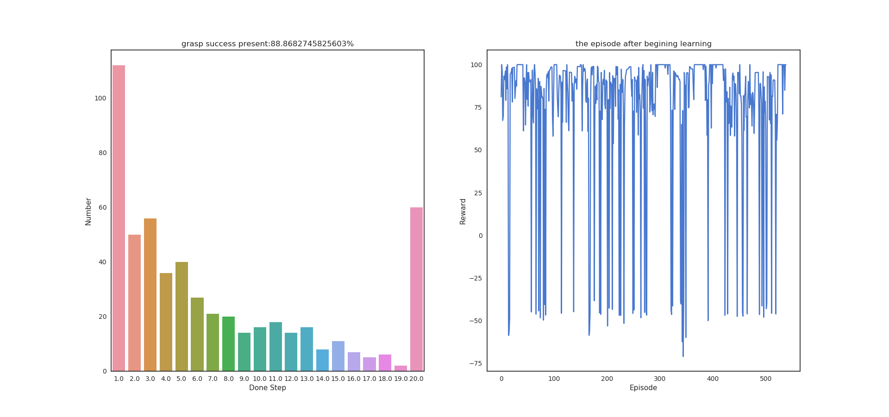
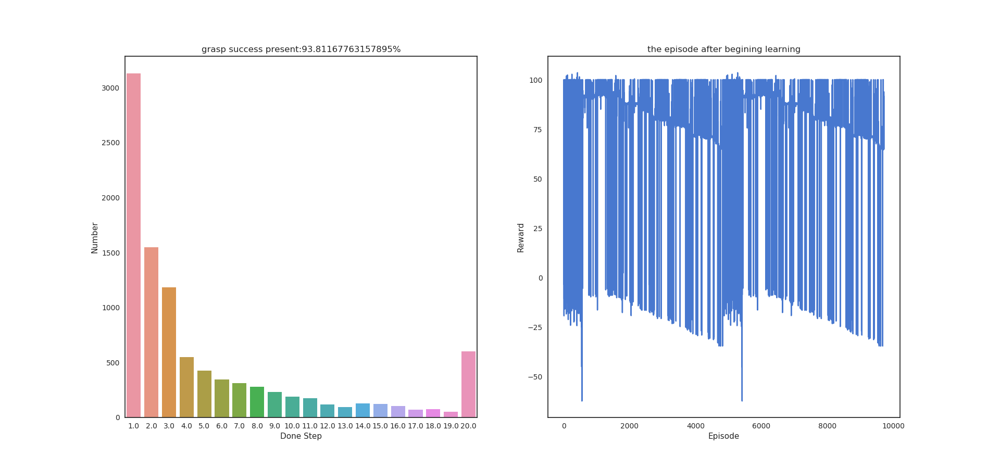

# THE FETCH TRAINING IN SERVER 2*TITANX(24G) #


Using Multi-GPU:

Except put your data and model in GPU, you need to using follow coda:
```python
device_ids = [0, 1]
net = Net().cuda(device_ids[0])
net = nn.DataParallel(net, device_ids=device_ids)
optimizer = torch.optim.Adam(eval_net.parameters(), lr=LR) 
optimizer = nn.DataParallel(optimizer, device_ids=device_ids)
optimizer.module.step()

```
